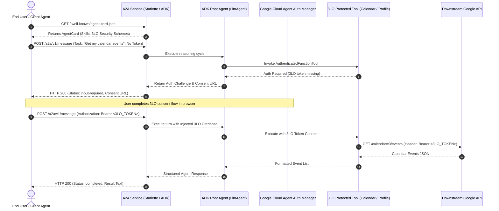

# 🤖 Google ADK Agent: A2A Protocol, Ambient SPIFFE Identity & 3LO Auth Manager

A minimal, production-grade demo agent built using **Google's Agent Development Kit (ADK)** that implements:
1. **Agent-to-Agent (A2A) Protocol**: Full A2A v1.0 standard with Agent Card manifest discovery, JSON-RPC 2.0, and HTTP-JSON task message endpoints.
2. **SPIFFE-Based Agent Identity**: Pure zero-trust ambient Agent Identity without Service Account keys, tokens, or static credentials.
3. **Agent Auth Manager 3-Legged OAuth (3LO)**: Delegated end-user authentication for tool execution with automatic token extraction and downstream Bearer header injection.

---

## 📐 Architecture & End-to-End Flow



---

## 🔒 1. Ambient SPIFFE Agent Identity (No Service Account Keys)

The agent relies purely on Google Cloud's ambient workload identity without provisioning or downloading service account JSON keys.

### Canonical SPIFFE Principal Format
```text
principal://agents.global.org-{ORG_ID}.system.id.goog/resources/aiplatform/projects/{PROJECT_NUM}/locations/{LOCATION}/reasoningEngines/{ENGINE_ID}
```

### Auth Provider IAM Policy Binding
To grant the agent engine permission to request user credentials from the Agent Auth Manager:
```bash
gcloud alpha agent-identity auth-providers add-iam-policy-binding \
  projects/${PROJECT_ID}/locations/${LOCATION}/authProviders/${AUTH_PROVIDER_NAME} \
  --member="principal://agents.global.org-${ORG_ID}.system.id.goog/resources/aiplatform/projects/${PROJECT_NUM}/locations/${LOCATION}/reasoningEngines/${ENGINE_ID}" \
  --role="roles/agentidentity.user"
```

---

## 🔑 2. Agent Auth Manager 3LO Integration

### Auth Provider Registration Specification
```json
{
  "authProviderId": "agent-3lo-auth-provider",
  "type": "OAUTH2",
  "oauth2Config": {
    "grantType": "AUTHORIZATION_CODE",
    "authorizationUri": "https://accounts.google.com/o/oauth2/v2/auth",
    "tokenUri": "https://oauth2.googleapis.com/token",
    "clientId": "YOUR_CLIENT_ID.apps.googleusercontent.com",
    "clientSecret": "YOUR_CLIENT_SECRET",
    "scopes": [
      "https://www.googleapis.com/auth/calendar.readonly",
      "https://www.googleapis.com/auth/userinfo.profile",
      "https://www.googleapis.com/auth/userinfo.email"
    ]
  }
}
```

### Native ADK Authenticated Tool Definition
Tools are configured with `AuthenticatedFunctionTool` and `AuthConfig`:
```python
from google.adk.tools.authenticated_function_tool import AuthenticatedFunctionTool
from auth_manager import create_auth_config

calendar_tool = AuthenticatedFunctionTool(
    func=get_user_calendar_events,
    auth_config=create_auth_config(),
    response_for_auth_required="AUTH_REQUIRED: Please complete 3LO authorization."
)
```

---

## 🚀 3. Quickstart & Local Verification

### 1. Install Dependencies
```bash
pip install -r requirements.txt
```

### 2. Configure Environment
```bash
cp .env.example .env
```

### 3. Run Local A2A Server
```bash
python3 server.py
```
Server starts on `http://127.0.0.1:8000` exposing:
- `GET /.well-known/agent-card.json`: A2A Agent Card discovery
- `GET /healthz`: Health and ambient SPIFFE identity summary
- `POST /a2a/v1/message`: REST/HTTP A2A task messaging endpoint
- `POST /`: JSON-RPC 2.0 A2A protocol endpoint

### 4. Run End-to-End Verification Suite
In a separate terminal (or directly via in-process ASGI):
```bash
python3 client_test.py
```

Expected Output:
```text
==================================================================
🧪 RUNNING ADK A2A SPIFFE AGENT VERIFICATION SUITE
==================================================================
🔍 [TEST 1/5] Testing A2A Agent Card Discovery...
   ✅ Received Agent Card: adk_spiffe_demo_agent (v1.0.0)
🔒 [TEST 2/5] Testing /healthz and Ambient SPIFFE Identity...
   ✅ Server Health: healthy
🛡️ [TEST 3/5] Testing Unauthenticated 3LO Request Fallback...
   ✅ Graceful 3LO Auth Challenge triggered (input-required)
🔑 [TEST 4/5] Testing Authenticated 3LO Calendar Access...
   ✅ Successfully retrieved calendar events with injected 3LO token
👤 [TEST 5/5] Testing Authenticated 3LO User Profile Access...
   ✅ Successfully verified user profile with 3LO delegation
==================================================================
📊 VERIFICATION RESULTS: 5/5 TESTS PASSED
🎉 ALL TESTS PASSED! ADK A2A SPIFFE Agent is fully operational.
==================================================================
```

---

## ☁️ 4. Deployment to Google Cloud

### Deploy to Vertex AI Agent Engine
```bash
python3 deploy.py
```
This script:
1. Provisions the agent in Vertex AI Agent Engine with `identity_type="AGENT_IDENTITY"`.
2. Automatically generates the SPIFFE Principal URI.
3. Binds `roles/agentidentity.user` to the SPIFFE Principal on the Auth Provider.
4. Creates the Agent Registry outbound binding for the Agent Gateway mesh.
5. Emits `deployment_metadata.json`.

### Deploy to Cloud Run with Agent Gateway Mesh
```bash
gcloud run services replace cloudrun_manifest.yaml --region=us-central1
```

---

## 📁 Repository Structure Tree

```text
adk_a2a_spiffe_agent/
├── .env.example              # Environment variables template
├── README.md                 # Complete documentation & architecture guide
├── pyproject.toml            # Python package specifications
├── requirements.txt          # Production dependencies
├── agent_card.json           # A2A v1.0 Agent Card Manifest
├── auth_manager.py           # 3LO Auth Provider registration & token extractor
├── spiffe_identity.py        # Ambient SPIFFE identity formatting & IAM bindings
├── agent.py                  # Core ADK Agent, AuthenticatedFunctionTools & fallback
├── a2a_service.py            # A2A Server & Client Wrapper (JSON-RPC & HTTP)
├── server.py                 # Local server entrypoint (Uvicorn on 127.0.0.1:8000)
├── client_test.py            # Automated end-to-end verification suite
├── deploy.py                 # Vertex AI Agent Engine provisioning script
└── cloudrun_manifest.yaml    # Cloud Run Agent Gateway mesh manifest
```
